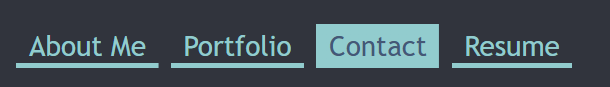

# My Portfolio

## Description

This project is my portfolio, showcasing my programming skills and demonstrating how I’ve grown as a programmer over time. It includes links to my GitHub, LinkedIn, and Instagram accounts for potential employers interested in my work. There is a Contact page where you can send me a message and a "Resume" page that highlights my skill set. Additionally, this project serves as a menu to easily view some of my top projects and access their repositories or deployed versions.

## Table of Contents

- [Installation](#installation)
- [Usage](#usage)
- [Credits](#credits)
- [License](#license)

## Installation

- Use this link [https://my-weather-app-uieh.onrender.com/](https://my-weather-app-uieh.onrender.com/) to get to deployed sit or if you want to play with source code on your own machine use following steps below.
- copy either all the files from the repository to your computer or use your git bash terminal to clone the repository down to your own machine. 
- make sure you have [node js](https://nodejs.org/en) and the package manager that comes with it.
- run the following command in project folder terminal: "npm i" (don't include the quotation marks). This will download all the needed dependencies for the project
- run the command in terminal "npm start" when your ready to start server for project on your local machine.

## Usage

- Once you’re on the website, you’ll see a prominent header at the top.
- My name is displayed in the header, with four tabs to the right (or below my name on smaller screens).
- 
- The active page will be highlighted in lightblue click on these tabs to change which page your on.
- The four pages are: About Me, Portfolio, Contact, and Resume.
- On the About Me page, you’ll find my picture followed by a brief bio.
- The Portfolio page showcases several of my projects, each represented by an image and project name.
- Click on any of those boxes to take you to that projects deployed website or if its project meant for your local machine it just redirects you to the repository of the project on GitHub instead.
- Next to the project name, there’s a GitHub icon. Click this icon to view the repository.
- The Contact page consists of three fields: name, email, and message. Once you fill out these fields with valid information, you can submit the form (contact me the email listed instead because the project currently dosen't have the right kind of server to handle the form submission).
- On the Resume page, you’ll find a link to download my resume and a list of my skills related to computer programming.
- A footer at the bottom of every page contains GitHub, LinkedIn, and Instagram icons. Click these icons to visit my personal accounts on those platforms.
- For a walkthrough of how to use the application [Click Here](https://drive.google.com/file/d/1KcmngBD_b9tmD80Io2LwZY8fUmbsh1d3/view).

## Credits

Project Designer: Kalab Smith
- [K-Lab-Code](https://github.com/K-Lab-Code)
- [kalabsb@me.com](mailto:kalabsb@me.com)

ChatGPT
- was used to create some of the pictures used for portfolio picks of some of the projects.

Utah University
- the image used for the portfolio link to my Prework Study Guide came from course page for web development coding bootcamp year 2024-2025.

## License

Distributed under the MIT License. See LICENSE.txt for more information.